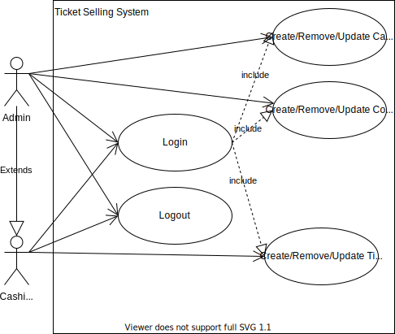
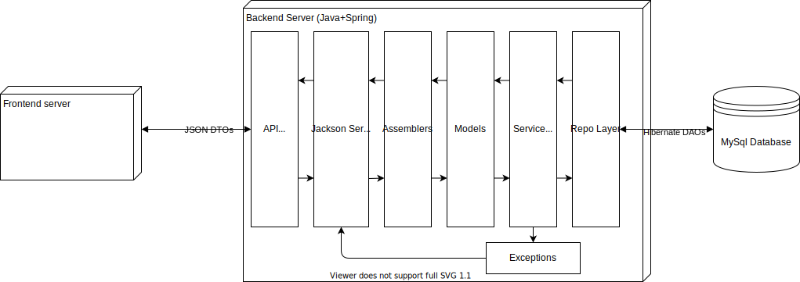

>Godra Adam @ UTCN 2021 Spring, Software Design, Assignment 1

# Ticket selling application

## Overview
We need to develop a solution for managing ticket sales for concerts at a given festival. This application will be utilized by staff responsible for selling tickets who need to be able to see the concerts that will be held and register ticket sales. In addition to this users with administrator rights can manage (create, edit, remove) concerts as well as add edit or remove cashiers to/from the system.

## Approach
The solution will be developed using the **Client-Server** architectural pattern. The server side will be developed in `Java` using the `Spring Boot` framework, and will persist its data to a `MySql` database. The frontend application will be developed using `JavaScript` and the `React` framework. The frontend will employ client-side rendering, thus the backend only needs to serve data but not views (i.e. html, css, etc.)

## Design

### Use cases

The below diagram details the different use cases specific to cashiers and admins
 </img>

### Backend

The backend application will have a **layered architecture**: 
`API layer`       
`Service layer`
`Model layer`
`Repository layer`

#### Model layer

Development starts with identifying the entities representing the problem at hand, namely:
`User`
`Concert`
`Ticket`
Additionally we define two enumerated types 
`Role`
`Genre`
Used by `User` and `Concert` accordingly

##### Model UML class diagram
 </img>

#### Repository layer

This layer is responsible for persisting/manipulating data in the database.
For each model class we will create a `DAO` (Data Access Object) which in our case will be interfaces extending Spring's `CrudRepository` generic interface. Database access implementation is handled(automagically generated) by `Hibernate`, embedded in the `Spring Data JPA` module.

#### Service layer

This layer constitues the business logic of our application. For every model class we define a corresponding Service class which operates on the given model class according to the needs of our application. This layer depends on both the `model` and `repository` layers.

#### API layer

This layer is responsible for 'presentation' which in this case simplifies to serving data in JSON format to the frontend, since where are working with a REST API. We need to secure certain endpoints so that only authorized users can access it, this will be done via Spring's `Web security` module. API endpoints starting with `/admin/` are available only to administrators. The web application is deployed automatically to Spring's built in `Tomcat` webserver.

Below are specified the available API endpoints:
- `/login` : `POST` mapping, expects a `username` and `password` field in its body for authentification. Unsecured(anybody can access it). If authentification is successful a `User` entity is returned containing no `password` filed, but instead a `Role` field for specifying whether the logged in user is an admin or a cashier. 
    - Http status `200 OK`: authentification succesful
    - Http status `401 UNAUTHORIZED`: wrong credentials, could not be logged in
---
- `/admin/api/user/cashiers` : `GET` mapping, returns a list of cashier entities registered in the system. It expects an authorization header containing administrator crendentials.
    - Http status `200 OK`: authentification succesful
    - Http status `401 UNAUTHORIZED`: failed to provide credentials
    - Http status `403 FORBIDDEN`: wrong credentials or non-admin credentials
---
- `/admin/api/user/register/cashier`: `POST` mapping, expects a username and password in its body, as well as an authorization header.
    - Http status `201 CREATED`: registration successful
    - Http status `401 UNAUTHORIZED`: credentials not provided
    - Http status `403 FORBIDDEN` : wrong credentials
    - Http status `422`: invalid cashier username and/or password
    - Http status `409 CONFLICT`: username is already taken
---
- `/api/concert/all` : `GET` mapping returns a list of all concerts registered in the system. Cashier or admin credentials need to be provided in the header.
    - Http status `401 UNAUTHORIZED`: credentials not provided
    - Http status `403 FORBIDDEN` : wrong credentials
---
- `/api/concert/genre/{genre}` : Same as above but returns a list of concerts with the genre corresponding to the path variable {genre}.
    - Http status `400 BAD_REQUEST`: specified genre is invalid
---
- `/api/concert/performer/{performer}` : Same as `api/concert/all` but filtered by performer specified in path variable {performer}
---
- `/admin/api/concert/add` : `POST` mapping. expects a Concert entity in its body as well as admin credentilas in the heder. Returns the Concert entity created if successful.
    - Http status `422 UPROCESSABLE_ENTITY`: if one or more of the fields is invalid
    - Http status `401 UNAUTORIZED` : crendentials not provided
    - Http status `409 FORBIDDEN` : wrong credentials
---
- `/api/ticket/{concertId}` : `GET` mapping, returns a list of tickets sold for the concert specified by the path variable identifier {concertId}
    - Http status `404 NOT_FOUND` : if the concertId is not associated with any concert
---
- `api/ticket/sell` : `POST` mapping, expects a Ticket entity in its body as well as cashier or admin credentials in the header. Returns the ticket entity sold or:
    - Http status `409 CONFLICT`: if the number of tickets sold exceeds tickets allocated for the given concert

##### DTO and Assembler packages
 Are contained in the API layer. For each model class corresponds a DTO class for data transfer between the server and the client. This reduces bandwidth usage as well as hide data specific to the server (for example passwords). Assembler classes are responsible for the mapping between the DTO and the corresponding model classes.

#### Exceptions
We defined a few custom exceptions that are instantiated in the service layer and thrown upwards to the upper layers, to the API endpoints where they will be mapped one-to-one to an Http status. This operation is handled automatically by Spring's included `Jackson` library
 ## High level overview of the system

 </img>

>Check out the code on [github](https://github.com/godraadam/tellerede)!

## Bibliography
https://www.baeldung.com/
https://tailwindcss.com/
https://reactjs.org/
