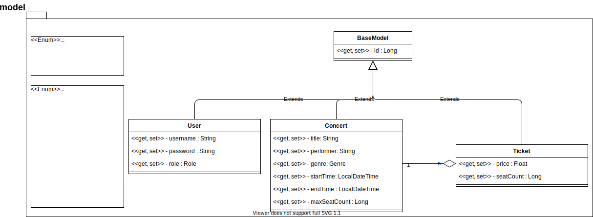

>Godra Adam @ UTCN 2021 Spring, Software Design, Assignment 1

# Ticket selling application

## Overview
We need to develop a solution for managing ticket sales for concerts at a given festival. This application will be utilized by staff responsible for selling tickets who need to be able to see the concerts that will be held and register ticket sales. In addition to this users with administrator rights can manage (create, edit, remove) concerts as well as add edit or remove cashiers to/from the system.

## Approach
The solution will be developed using the **Client-Server** architectural pattern. The server side will be developed in `Java` using the `Spring Boot` framework, and will persist its data to a `MySql` database. The frontend application will be developed using `JavaScript` and the `React` framework.

## Design

### Backend

The backend application will have a **layered architecture**: 
`API layer`       
`Service layer`
`Model layer`
`Repository layer`

#### Model layer

Development starts with identifying the entities representing the problem at hand, namely:
`User`
`Concert`
`Ticket`
Additionally we define two enumerated types 
`Role`
`Genre`
Used by `User` and `Concert` accordingly

##### Model UML class diagram
 </img>

#### Repository layer

This layer is responsible for persisting/manipulating data in the database.
For each model class we will create a `DAO` (Data Access Object) which in our case will be interfaces extending Spring's `CrudRepository` generic interface. Database access implementation is handled(automagically generated) by `Hibernate`, embedded in the `Spring Data JPA` module.

#### Service layer

This layer constitues the business logic of our application. For every model class we define a corresponding Service class which operates on the given model class according to the needs of our application. This layer depends on both the `model` and `repository` layers.

#### API layer

This layer is responsible for 'presentation' which in this case simplifies to serving data in JSON format to the frontend, since where are working with a REST API not a SOAP API